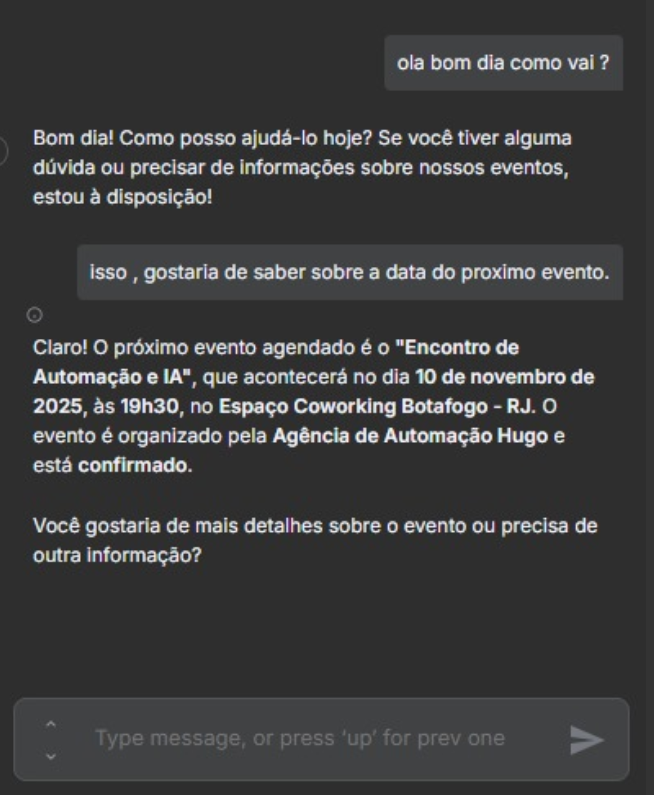
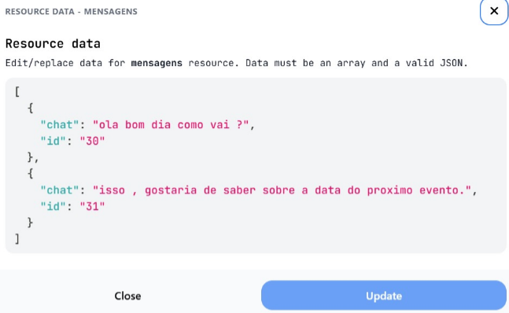
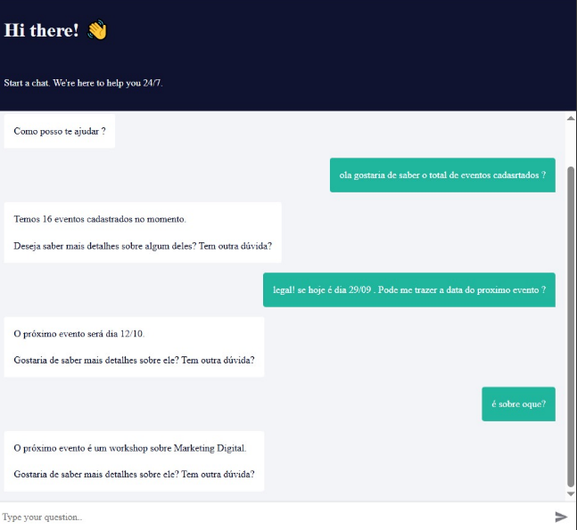
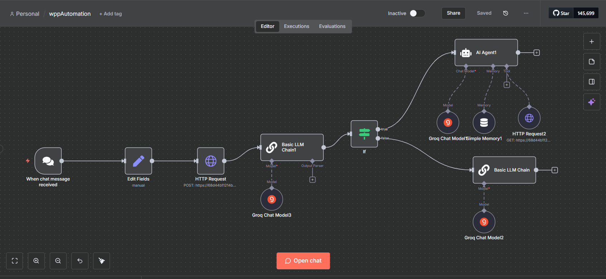
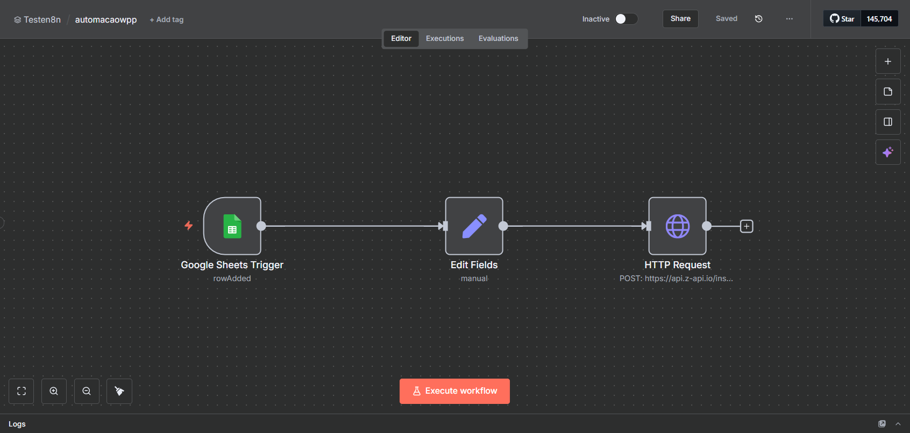
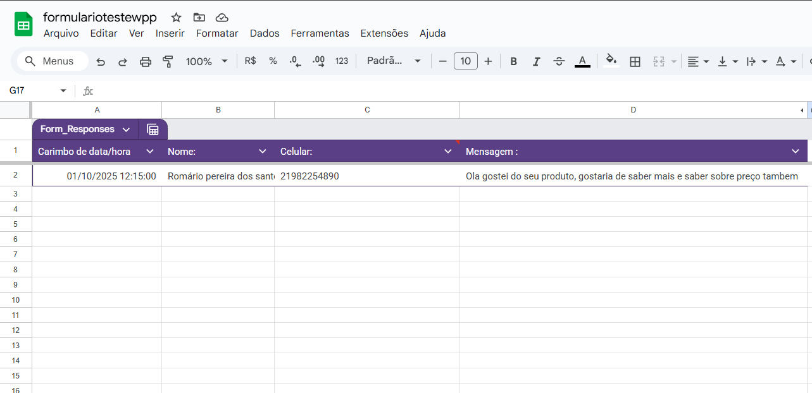
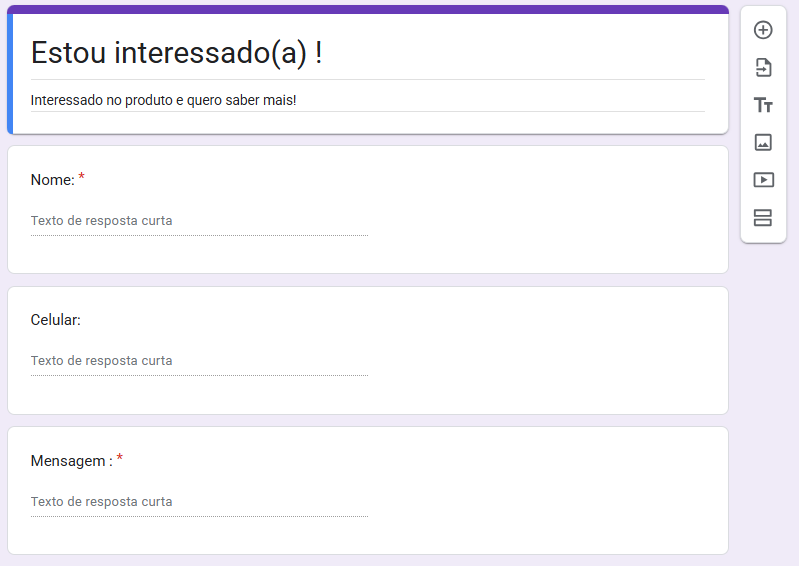
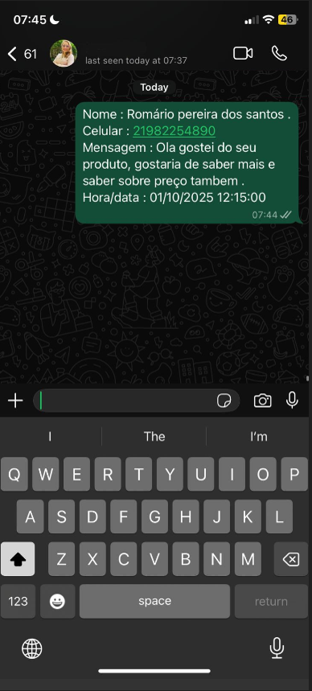
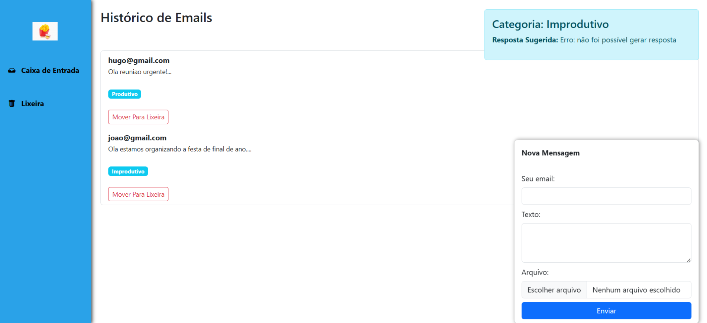
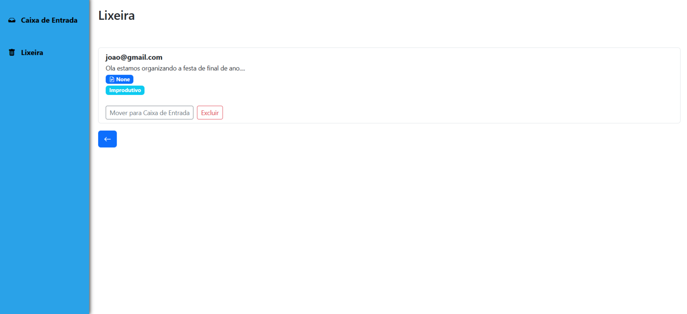

# Portfólio de Automação

Bem-vindo ao meu portfólio!  
Aqui compartilho alguns projetos de automação que desenvolvi, unindo inteligência artificial, integrações web, com ferramentas e fluxos de trabalho personalizados.  

Cada projeto tem título, link para demo (quando disponível), breve descrição e espaço reservado para imagens ilustrativas.  

------

---

## 🛠️ Tecnologias & Ferramentas

  <!-- Low-code / Automação -->
  
  
  
  
  <!-- Backend -->
  
  
  
  

  <!-- Frontend -->
  
  
  
  

  <!-- Banco de Dados -->
  
  

  <!-- DevOps / Outros -->
  
  
  

## Chatbot de Atendimento Inteligente com IA
**Demo:** [www.demo](#)  

Descrição:

Destaques técnicos:

**Descrição:**  
Projeto de Assistente Virtual Inteligente desenvolvido com um AI Agent para automatizar o atendimento ao cliente, oferecendo respostas contextualizadas de acordo com o produto e o core business da empresa.
O chatbot atua como primeiro ponto de contato, reduzindo carga do time de suporte e aumentando a eficiência no atendimento.

**Destaques técnicos:**  

- Integração de fluxos no n8n para orquestração do atendimento.
- Uso de Google Sheets como base de dados dinâmica para armazenar informações de produtos e FAQs.
- Implementação de lógica condicional com If para personalização das respostas.
- Estrutura com 3 agentes inteligentes trabalhando em conjunto para qualificar o fluxo de conversas (identificação de intenção, consulta de dados e resposta final).
- Arquitetura flexível e escalável, permitindo expansão para novos produtos e cenários de negócio. 

**Imagens:**  
- 
- 
- 
- 

## Automação de fluxo com lead
**Demo:** [www.demo](#)  

Descrição:

Destaques técnicos:

**Descrição:**  
Projeto de automação de coleta e qualificação de leads.
O usuário preenche um formulário com nome, número de WhatsApp e interesse no produto. Esses dados são salvos em Google Sheets e automaticamente enviados para o WhatsApp da empresa, permitindo contato imediato com leads interessados.
O fluxo garante eficiência na captura e agilidade no atendimento, reduzindo o tempo de resposta e aumentando as chances de conversão.

**Destaques técnicos:**  

- Uso do Google Forms para coleta estruturada das informações.
- Armazenamento automático dos dados no Google Sheets.
- Integração e orquestração do fluxo com n8n.
- Envio de mensagens via API Z-API, entregando os dados do lead diretamente no WhatsApp da empresa.
- Fluxo simples, escalável e replicável para múltiplos produtos e campanhas.. 

**Imagens:**  

- 
- 
- 
- 

-------
## Classificador de Emails  
**Demo:** [https://classificacaoemail-huggingfaceai.onrender.com](#)  

**Descrição:**  
Projeto que utiliza **IA (Hugging Face)** para classificar emails em duas categorias:  
- **Produtivo** → tarefas, reuniões, contratos, prazos.  
- **Improdutivo** → mensagens sociais, cortesia, newsletters.  

**Destaques técnicos:**  
- Uso combinado de **zero-shot classification** e **few-shot prompting**.  
- Pré-processamento de texto com **NLTK** (remoção de stopwords).  
- Geração de respostas automáticas para emails classificados como improdutivos.  

**Imagens:**  
-   
- 